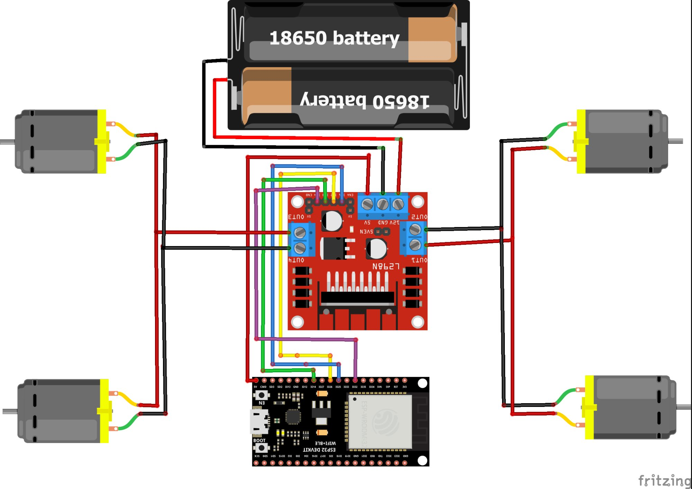

# RC Car — ESP32 + MQTT

Mobil RC 4WD berbasis ESP32 yang dikontrol via MQTT menggunakan browser.



## Hardware
- ESP32
- ESP32 Shield (Opsional)
- Driver motor L298N
- Motor DC x4
- Holder Baterai 18650 2 Slot

## Koneksi Pin
| ESP32 | L298N |
|-------|-------|
| GPIO26 | IN1 |
| GPIO25 | IN2 |
| GPIO14 | IN3 |
| GPIO32 | IN4 |

## Cara Pakai

### 1. Edit `mobil_mqtt.ino`
Ubah bagian konfigurasi di baris paling atas:
```cpp
const char* WIFI_SSID     = "NAMA_WIFI_KAMU";
const char* WIFI_PASSWORD = "PASSWORD_WIFI_KAMU";
const char* topic         = "USERNAME/rc/rc-car-controller/car";
```

### 2. Edit `web_kontrolv2.html`
Ubah topic agar **sama persis** dengan yang ada di `.ino`:
```js
const MQTT_TOPIC = 'USERNAME/rc/rc-car-controller/car'
```

### 3. Upload ke ESP32
Upload `mobil_mqtt.ino` via Arduino IDE.

### 4. Buka web controller
Buka `web_kontrolv2.html` di browser HP atau laptop.

## Library Arduino
- [MQTT by 256dpi](https://github.com/256dpi/arduino-mqtt)
